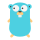

<h1> Hey  What's up?</h1>

 My name is Mauro and I'm a software developer, from  <b>Brasil</b>.

## About me

- ✨ Creating bugs since 2019
- 📚 Currently learning:    
- 🎯 Goals: live in a cold place ❄ and speak english 🚀
- 🎲 And ... I play 🎸 guitar and ♟ chess online

## I code with

